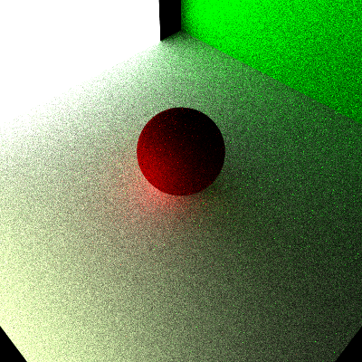
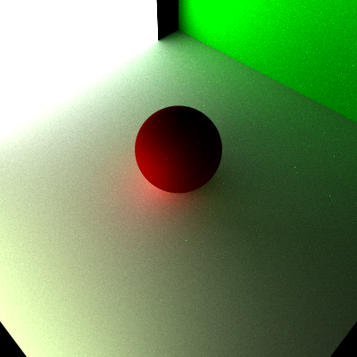

Path Tracer Episode II: Attack of the Rays
======================

**University of Pennsylvania, CIS 561: Advanced Computer Graphics, Homework 4**

Path Tracer Episode I: The Sampling Menace
======================

* Name: Xi Yang
* PennKey: 43486159

Implement
------------

cosine weighted(square root of pixel samples count = 10, recursion limit=5)

cosine weighted(square root of pixel samples count = 50, recursion limit=5)

